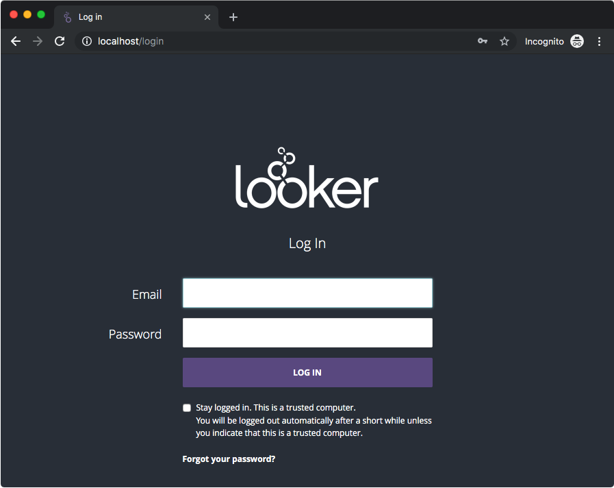

# Looker on Docker

❗️ Disclaimer: Docker is not currently a supported configuration for Looker. This information is
offered since many Looker customers have expressed interest, but is not guaranteed
in any way.

## Getting Started

1. [Install Docker](https://www.docker.com/products/docker-desktop).
1. Clone this repository.

        git clone git@github.com:looker/docker_looker.git
        cd docker_looker

1. Replace the `license_key` in `config/provision.yml` with a valid Looker license.
1. Start Looker.

        docker-compose up -d

1. Open Looker in your browser.

        open http://localhost

1. Shut down Looker.

        docker-compose down

## Troubleshooting

* Use the `logs` command to watch for error during startup.

        docker-compose logs -f --tail 100

* Rebuild the `looker` Docker image.

        docker images | grep looker
        docker rmi docker_looker_looker
        docker-compose up -d

### Acknowledgements

The majority of this work was done in [a Discourse thread here](https://discourse.looker.com/t/running-on-premise-looker-in-a-docker-container/5030/11).

* [Mike DeAngelo](https://github.com/deangelo-llooker)
* [Todd Foley](https://github.com/dev-head)
* [Troy Harvey](https://github.com/troyharvey)
